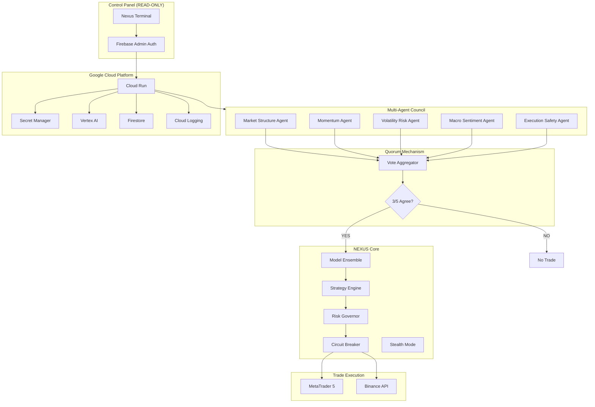

# NEXUS SOVEREIGN SYSTEM v3.0

> **IMMUTABLE LAW**: Council Over King - No trade without quorum.

**Architecture**: Ancient Market Laws × Axelrod Game Theory × Netflix Resilience  
**Decision Engine**: Multi-Agent Council (5 Agents, 3/5 Quorum Required)  
**Intelligence**: Model Ensemble (Gemini Pro + Rule-Based + Pattern)  
**Execution**: Dual-Path (MT5 + Binance)  
**Risk Governor**: Kelly Criterion × Drawdown Enforcement  
**Security**: Stealth Mode (Encrypted Logs, Self-Purge Capability)

---

## System Architecture



---

## Immutable Core Laws

| # | Law | Implementation |
|---|-----|----------------|
| 1 | **No Single Point of Failure** | Multi-agent voting, no master brain, auto-scaling |
| 2 | **Council Over King** | 5 independent agents, quorum required (3/5) |
| 3 | **Silence Is Security** | Minimal response data, encrypted logs, stealth mode |
| 4 | **Preservation > Profit** | 2% max drawdown, Safety Agent has veto power |
| 5 | **Failure Is Assumed** | Circuit breakers, auto-halt, self-heal, self-purge |

---

## Multi-Agent Council

### The Five Agents

| Agent | Role | Weight | Specialty |
|-------|------|--------|-----------|
| **Market Structure** | Wyckoff Analysis | 1.2 | Accumulation/Distribution phases |
| **Momentum** | Force Detection | 1.0 | ROC + RSI momentum scoring |
| **Volatility Risk** | Storm Warning | 1.3 | ATR percentile, regime detection |
| **Macro Sentiment** | Tide Reading | 0.9 | MA200 positioning, regime alignment |
| **Execution Safety** | Gatekeeper | 1.5 | Spread, circuit breakers, anomalies |

### Quorum Rules

- **Minimum Agreement**: 3 out of 5 agents must agree on direction
- **Weighted Voting**: Agents have different weights based on expertise
- **Safety Veto**: Execution Safety Agent can veto any trade
- **Position Sizing**: Lower consensus = reduced position size

### Trade Execution Flow

```
1. Stealth Mode Check     → System operational?
2. Agent Council          → 3/5 quorum required
3. Model Ensemble         → AI + Rule-based consensus
4. Ancient Logic          → Cycle alignment check
5. Risk Governor          → Drawdown & position limits
6. Circuit Breaker        → API & price stability check
7. Execution              → Dual-path (MT5 + Binance)
```

---

## Core Modules

### Multi-Agent Council (`agent_council.py`) 🆕
Five independent trading agents with quorum voting:
- **MarketStructureAgent**: Wyckoff accumulation/distribution patterns
- **MomentumAgent**: Price momentum + volume confirmation
- **VolatilityRiskAgent**: ATR-based risk assessment (veto power on extreme vol)
- **MacroSentimentAgent**: MA50/200 positioning and regime alignment
- **ExecutionSafetyAgent**: Pre-trade safety validation (has veto power)

### Model Ensemble (`model_ensemble.py`) 🆕
Multiple AI models vote on market direction:
- **GeminiPro**: Vertex AI regime detection and analysis
- **RuleBased**: Classical technical analysis scoring
- **PatternMatcher**: Historical pattern similarity

### Stealth Mode (`stealth_mode.py`) 🆕
Security and obfuscation features:
- Encrypted audit logging
- Response minimization
- Order timing randomization
- Access anomaly detection
- Self-purge capability

### Strategy Engine (`strategy_engine.py`)
Five ancient market principles:
- **TrendFollower**: EMA crossovers (9/21/50) with momentum confirmation
- **MeanReversion**: Bollinger Bands + RSI divergence detection
- **LiquiditySweep**: Volume spike detection at swing levels
- **TimeCycles**: London/NY session alignment
- **FearGreed**: Contrarian sentiment oscillator

### Intelligence Module (`intelligence.py`)
- **RegimeDetector**: ADX-based trend/range/volatile classification
- **VolatilityClustering**: GARCH-like persistence analysis
- **AnomalyDetector**: Flash crash and volume spike detection
- **AI Analysis**: Gemini Pro market assessment

### Risk Governor (`risk_governor.py`)
Axelrod discipline enforcement:
- 2% max drawdown hard limit
- 5% max position size
- Kelly Criterion position sizing
- Correlation limits across positions
- Firestore state persistence
- Emergency shutdown capability

### Execution Engine (`execution.py`)
Institutional-grade execution:
- MT5 primary execution path
- Binance secondary/failover
- Slippage control (0.1% max)
- Order tracking and reconciliation
- Circuit breaker protection

### Circuit Breaker (`circuit_breaker.py`)
Netflix Hystrix patterns:
- API failure tracking (3 failures = halt)
- Price movement breaker (5% in 15 min)
- Connectivity monitoring
- Global halt capability

---

## Quick Start

### 1. Environment Setup
```powershell
# Set Google Cloud credentials
$env:GOOGLE_APPLICATION_CREDENTIALS="path\to\serviceAccountKey.json"

# Set project
gcloud config set project nexus-dyron-777
```

### 2. Install Dependencies
```powershell
cd nexus-genesis/nexus-core
python -m venv venv
.\venv\Scripts\Activate
pip install -r requirements.txt
```

### 3. Configure Secrets
Add these secrets to Google Secret Manager:
- `BINANCE_API_KEY`
- `BINANCE_API_SECRET`
- `MT5_LOGIN`
- `MT5_PASSWORD`
- `MT5_SERVER`
- `POLYGON_API_KEY`

### 4. Launch System
```powershell
# Development mode
uvicorn app.main:app --reload --port 8080

# Or use dev script
.\dev.ps1
```

---

## API Endpoints

### Health & Status
| Endpoint | Method | Description |
|----------|--------|-------------|
| `/health` | GET | System health check |
| `/status` | GET | Comprehensive system status |
| `/risk-status` | GET | Current risk metrics |

### Analysis (Advisory Only)
| Endpoint | Method | Description |
|----------|--------|-------------|
| `/analyze` | POST | AI market analysis |
| `/analyze/full` | POST | Full strategy + intelligence analysis |

### Execution
| Endpoint | Method | Description |
|----------|--------|-------------|
| `/trade` | POST | Execute trade (governor-approved) |
| `/kill` | POST | Emergency kill switch |
| `/resume` | POST | Resume trading (requires admin key) |

### Dashboard (READ-ONLY)
| Endpoint | Method | Description |
|----------|--------|-------------|
| `/dashboard/equity-curve` | GET | Equity and P&L data |
| `/dashboard/positions` | GET | Open positions |
| `/dashboard/orders` | GET | Recent order history |

---

## Deployment

### Google Cloud Run
```powershell
# One-time setup
gcloud artifacts repositories create nexus-repo \
    --repository-format=docker \
    --location=us-central1

# Create service account
gcloud iam service-accounts create nexus-runtime \
    --display-name="NEXUS Runtime Service Account"

# Grant permissions
gcloud projects add-iam-policy-binding nexus-dyron-777 \
    --member="serviceAccount:nexus-runtime@nexus-dyron-777.iam.gserviceaccount.com" \
    --role="roles/secretmanager.secretAccessor"

gcloud projects add-iam-policy-binding nexus-dyron-777 \
    --member="serviceAccount:nexus-runtime@nexus-dyron-777.iam.gserviceaccount.com" \
    --role="roles/aiplatform.user"

# Deploy
gcloud builds submit --config cloudbuild.yaml .
```

---

## Testing

```powershell
# Run all tests
pytest -v --cov=app/services

# Test brain connection
python test_brain.py

# Stress test risk governor
python stress_test.py
```

---

## Security Model

See [SECURITY.md](SECURITY.md) for complete security documentation.

**Key Principles:**
- Zero secrets in code or frontend
- All secrets via Secret Manager
- Service account with minimal IAM
- Authenticated Cloud Run access
- Complete audit logging

---

## Disaster Recovery

See [DISASTER_RECOVERY.md](DISASTER_RECOVERY.md) for recovery procedures.

**Quick Recovery:**
1. Trigger kill switch: `POST /kill`
2. Review Firestore state
3. Clear circuit breakers
4. Resume with admin key: `POST /resume`

---

## License

Private and Confidential. Unauthorized use prohibited.
